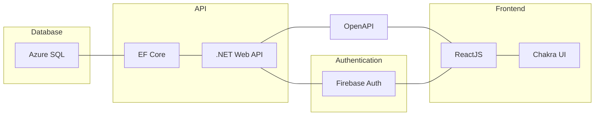

# Instructr

## Infrastructure

```mermaid
flowchart LR
    A --- B
    C --- D[OpenAPI] --- E
    C --- G --- E    

    subgraph Database
    A[Azure SQL]
    end

    subgraph API
    B[EF Core] --- C[.NET Web API]
    end
    
    subgraph Frontend
    E[ReactJS] --- F[Chakra UI]
    end
 
    subgraph Authentication
    G[Firebase Auth]
    end
```
