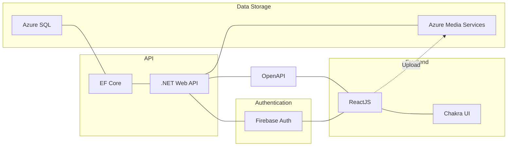

# Instructr

## Infrastructure

```mermaid
flowchart LR
    A --- B
    C --- D[OpenAPI] --- E
    C --- G --- E
    E -. Upload .-> H --- C
    

    subgraph Data Storage
    A[Azure SQL]
    H[Azure Media Services]
    end

    subgraph API
    B[EF Core] --- C[.NET Web API]
    end
    
    subgraph Frontend
    E[ReactJS] --- F[Chakra UI]
    end
 
    subgraph Authentication
    G[Firebase Auth]
    end
```
Made with [mermaid](https://mermaid-js.github.io/mermaid/#/flowchart)
