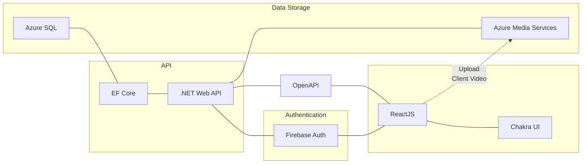
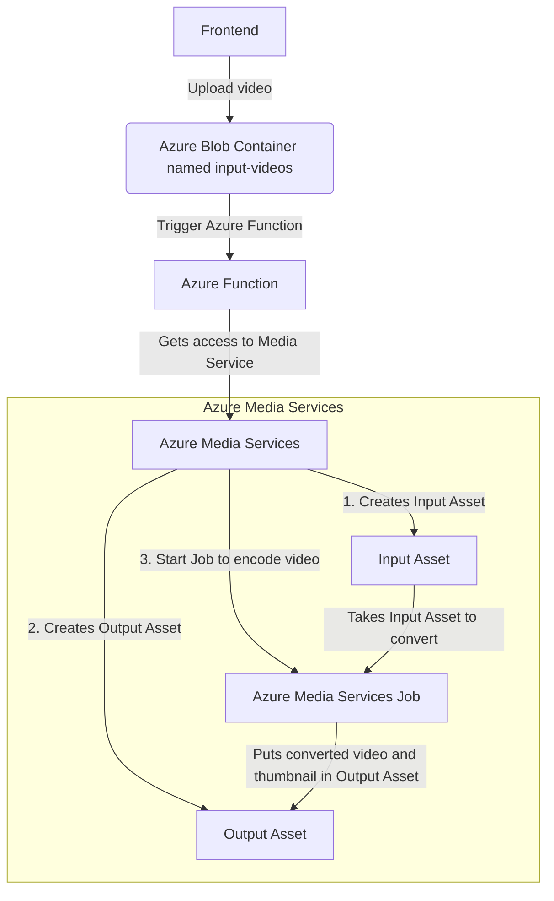

# Instructr

## Infrastructure


### User sign-up flows
**Regular client sign-up**
```mermaid
graph LR
    A(New client) --> |Send passwordless link| B(Pending verification)
    B --> |"Passwordless link press (email cached)"| C(Client created)
    B --> |Passwordless link press| D(Confirming email)
    D --> |Email typed in correctly| C
    subgraph Client created in<br/>Firebase and backend
    C
    end
```
**Instructor adds client to lesson**
```mermaid
graph LR
    A(New client) --> |Create by email and name| B(Pending verification)
    subgraph Client created in backend
    B --> |Send passwordless link| B
    D
    end
    B --> |"Passwordless link press (email cached)"| C(Client created)
    B --> |Passwordless link press| D(Confirming email)
    D --> |Email typed in correctly| C
    subgraph Client created in<br/>Firebase and backend
    C(Client created)
    end
```

### Client Video Upload & Conversion Flow


---

Made with [mermaid](https://mermaid-js.github.io/mermaid/#/flowchart)
